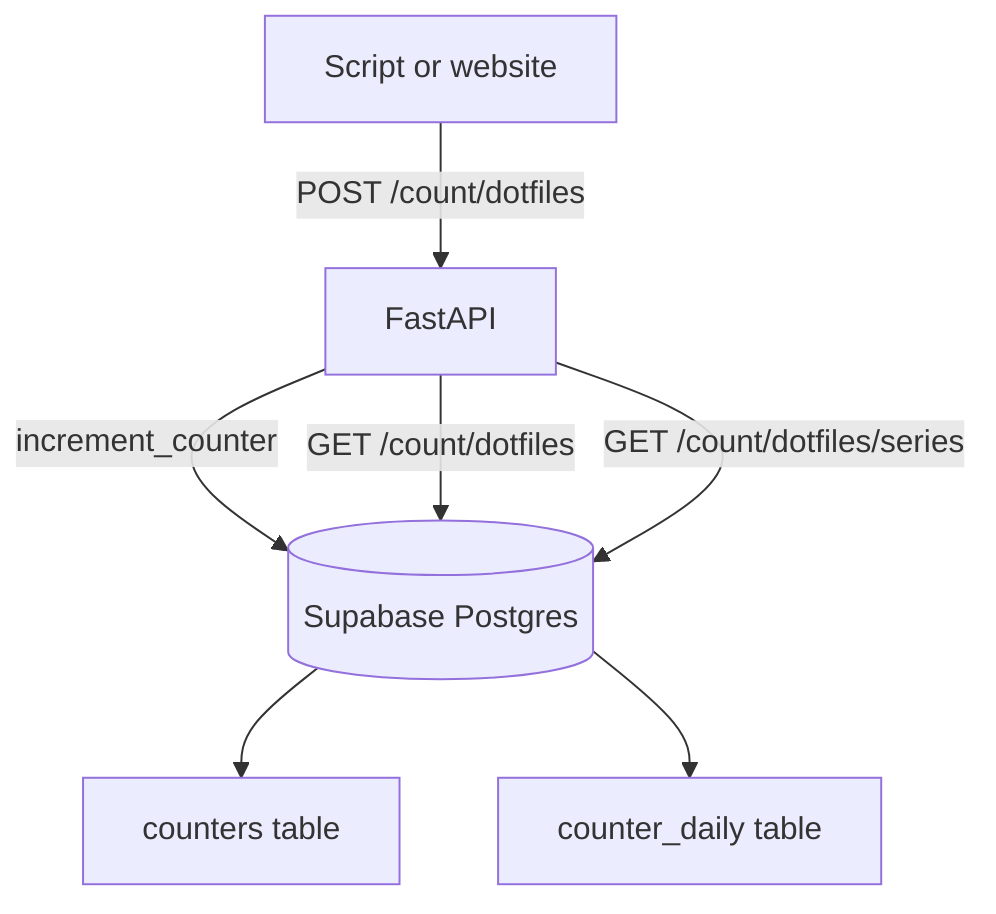

# Database Schema

This document explains the current CounterHub database design, why it looks the way it does, and how to read the migrations.

If you want the exact source of truth, read:

- `supabase/migrations/20260621205825_initial_counter_daily_schema.sql`
- `supabase/migrations/20260621214918_register_dotfiles_counter.sql`

This page is the human explanation of those files.

## Objective

CounterHub is intentionally small.

The goal is:

- keep the client API simple
- count usage safely under concurrency
- preserve lightweight history for graphs and month-by-month reporting
- prevent arbitrary counter names from being created by random callers

That is why the database has:

- a `counters` table as a registry of allowed counter names
- a `counter_daily` table for daily rollup history
- SQL functions for incrementing counters and reading summaries or time series

## High-Level Flow



## Write Behavior

When a client calls:

```text
POST /count/dotfiles
```

CounterHub does this:

1. checks whether `dotfiles` exists in `public.counters`
2. if it exists and is enabled, increments today's bucket in `public.counter_daily`
3. if today's bucket does not exist yet, creates it with `count = 1`
4. if the counter is not registered, returns `404`

That means:

- registered counter + same day: increment existing row
- registered counter + new day: create a new daily row
- unknown counter: reject the request

## Data Shape

Example registry:

```text
counters
--------
dotfiles
portfolio
homelab
```

Example daily history:

```text
counter_id | bucket_date | count
dotfiles   | 2026-01-01  | 4
dotfiles   | 2026-01-12  | 7
dotfiles   | 2026-01-28  | 6
```

This gives us:

- very small storage compared with raw per-hit events
- enough history for charts
- enough history for monthly or range-based reporting
- safe concurrent increments

## Migration Structure

The current migration setup does two conceptual things:

1. the initial schema migration creates the tables, index, SQL functions, and permissions
2. a second migration explicitly registers `dotfiles` as the first allowed counter

That separation is deliberate:

- migration 1: structure
- migration 2: allowed production-ready counter registration

## Table Design

### `public.counters`

This is the registry of allowed counters.

Columns:

- `id`: the allowed counter name, like `dotfiles` or `portfolio`
- `description`: optional human-readable description
- `enabled`: whether the counter is currently allowed to receive increments
- `created_at`: when the counter was registered

Purpose:

- stops unknown names from being created by random callers
- gives you a simple allow-list inside the database
- lets you disable a counter without deleting its history

### `public.counter_daily`

This is the daily rollup history.

Columns:

- `counter_id`: the registered counter name
- `bucket_date`: the day the count belongs to
- `count`: the total count for that counter on that day
- `updated_at`: the last time that daily bucket changed

Primary key:

- `(counter_id, bucket_date)`

Why this is useful:

- one row per counter per day
- compact storage
- simple range queries
- safe concurrent increments when paired with the SQL function

## SQL Walkthrough

### 1. Create the counters registry

```sql
create table public.counters (
    id text primary key,
    description text,
    enabled boolean not null default true,
    created_at timestamptz not null default now(),
    check (char_length(trim(id)) > 0)
);
```

This is the allow-list of valid counters.

### 2. Create the daily rollup table

```sql
create table public.counter_daily (
    counter_id text not null references public.counters(id) on delete cascade,
    bucket_date date not null default current_date,
    count bigint not null default 0,
    updated_at timestamptz not null default now(),
    primary key (counter_id, bucket_date),
    check (count >= 0)
);
```

What this means:

- `counter_id` must exist in `public.counters`
- deleting a counter can also remove its daily history
- there is at most one row per counter per day

### 3. Create the lookup index

```sql
create index counter_daily_counter_date_idx
    on public.counter_daily (counter_id, bucket_date desc);
```

This helps the database quickly find the history for one counter in date order.

### 4. Create the atomic increment function

```sql
create or replace function public.increment_counter(counter_name text)
```

This function only inserts or updates a row if the counter exists in `public.counters` and is enabled.

That means:

- known counter: increment works
- unknown counter: no row is created
- disabled counter: no row is created

This keeps the write endpoint simple while protecting the namespace.

### 5. Create the summary function

```sql
create or replace function public.get_counter_summary(counter_name text)
```

This function returns one summary row for a registered counter, including:

- total count across all days
- last updated time
- first day with data
- last day with data

If the counter is not registered, it returns no row.

### 6. Create the series function

```sql
create or replace function public.get_counter_series(
    counter_name text,
    start_date date default null,
    end_date date default null
)
```

This function returns the daily history points for a registered counter.

That is what you use to:

- build a graph
- sum a specific month
- compare time ranges

## Query Ideas

Examples of questions this design can answer:

- current total for `dotfiles`
- total in January 2026
- increase between two months
- simple line chart over time

The API endpoint for charts is:

```text
GET /count/{counter_id}/series?start=YYYY-MM-DD&end=YYYY-MM-DD
```

## Seed Data vs Migrations

It is important to keep these separate.

- migrations define the database structure and intentional production-ready registrations
- `supabase/seed.sql` defines repeatable local development history data

Structure belongs in migrations.
Fake usage history belongs in the seed file.

## In Short

This design is intentionally small:

- one `counters` registry table
- one `counter_daily` history table
- one atomic increment function
- one summary function
- one series function
- one backend-only access pattern

That is enough to start building, show totals, draw simple graphs, and prevent arbitrary counter names from being created.
